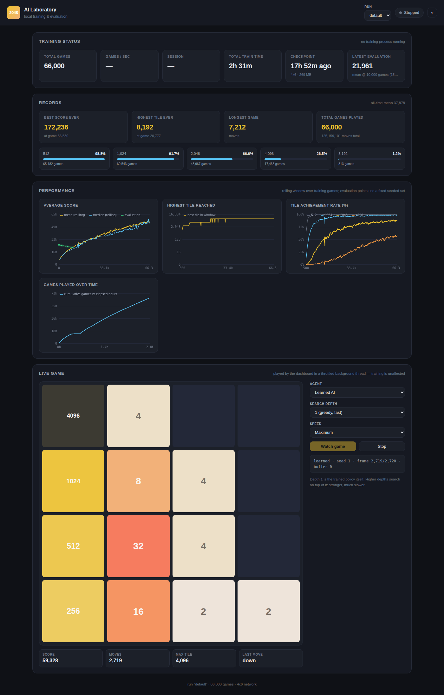

# 2048 AI

[](https://github.com/esturisky7-ux/2048-ai/actions/workflows/tests.yml)
[](https://www.python.org/downloads/)
[](LICENSE)
[](#requirements)

A high-performance 2048 AI laboratory: train agents that learn the game by
playing it, evaluate them with confidence intervals, compare strategies head to
head on identical games, and watch the whole thing progress in a local web
dashboard.

Everything runs on the **Python 3 standard library**. There is nothing to
install, nothing to compile, no `pip`, no NumPy, no GPU. It was developed on a
dual-core Celeron laptop and is fast there.



---

## Quick start

```bash
git clone https://github.com/esturisky7-ux/2048-ai.git
cd 2048-ai
python3 train.py --games 1000
```

That is the whole installation. On **Windows**, write `py` or `python` instead
of `python3`:

```powershell
git clone https://github.com/esturisky7-ux/2048-ai.git
cd 2048-ai
py train.py --games 1000
```

A thousand games takes about a minute and already produces an agent that
reaches the 512 tile. Then:

```bash
python3 train.py --resume          # keep training where you left off
python3 server.py                  # dashboard at http://127.0.0.1:8000/
python3 evaluate.py --games 200    # how good is it, with error bars
```

Every command explains itself:

```bash
python3 train.py --help
python3 evaluate.py --help
python3 server.py --help
python3 experiment.py --help
```

And to confirm the install works before doing anything else:

```bash
python3 train.py --check
```

```
2048-ai 1.0.0  (Python 3.12.3 on Linux x86_64, 64-bit)
project root  /home/you/2048-ai
engine        ok  (merge rules, 16 empty cells on a blank board)
training      ok  (20 games, best score 5,552)
checkpoint    ok  (wrote meta.json and weights.f32)
workers       start method 'fork'
```

---

## Table of contents

- [Overview](#overview)
- [Features](#features)
- [How it works](#how-it-works)
- [The AI: TD(0) afterstate n-tuple learning](#the-ai-td0-afterstate-n-tuple-learning)
- [The four agents](#the-four-agents)
- [Project architecture](#project-architecture)
- [Requirements](#requirements)
- [Linux installation](#linux-installation)
- [macOS installation](#macos-installation)
- [Windows installation](#windows-installation)
- [Starting a new training run](#starting-a-new-training-run)
- [Resuming training](#resuming-training)
- [Using multiple workers](#using-multiple-workers)
- [Evaluating an agent](#evaluating-an-agent)
- [Running the dashboard](#running-the-dashboard)
- [Watching the AI play](#watching-the-ai-play)
- [Running experiments](#running-experiments)
- [Running tests](#running-tests)
- [Understanding checkpoints](#understanding-checkpoints)
- [Performance and benchmarks](#performance-and-benchmarks)
- [Platform support](#platform-support)
- [Troubleshooting](#troubleshooting)
- [Project structure](#project-structure)
- [Security and networking](#security-and-networking)
- [Contributing](#contributing)
- [License](#license)

---

## Overview

2048 is a sliding-tile game: every move slides the whole board one way, equal
tiles merge, and the game drops a new tile in a random empty cell. It is easy
to play badly and genuinely hard to play well.

This repository is a laboratory for making a computer play it well, and for
being able to *prove* that one version plays better than another:

- a **bitboard engine** that simulates ~140,000 moves a second in pure Python;
- four **agents** of increasing strength, from uniform random to a learned
  value function;
- a **reinforcement-learning trainer** that improves by self-play and
  checkpoints so a run survives Ctrl-C, a crash or a power cut;
- an **evaluation harness** that replays the same seeded games for every agent
  and reports confidence intervals, so differences are measured, not claimed;
- an **experiment framework** that stores the exact config alongside each
  result;
- a **local web dashboard** with live charts and a game viewer.

After a couple of hours of training on a slow laptop, the learned agent reaches
the 2048 tile in about 89% of games and has produced the 8192 tile.

---

## Features

| | |
|---|---|
| **Zero dependencies** | Python 3.10+ standard library only. No install step. |
| **Fast pure-Python engine** | 64-bit bitboards, precomputed row tables, ~140k moves/s. |
| **Learns from self-play** | TD(0) on afterstates with an n-tuple value network. |
| **Crash-safe checkpoints** | Memory-mapped weights, atomic metadata, Ctrl-C always saves. |
| **Resume any run** | `--resume` continues from the exact game count. |
| **Multi-core training** | `--workers N` shares one weight table across processes. |
| **Honest evaluation** | Identical seeded games per agent, 95% CIs, Wilson intervals for tile rates. |
| **Experiment framework** | 18 shipped configs; each result stores the config that produced it. |
| **Live dashboard** | Training status, charts, records, and a game viewer, all localhost-only. |
| **Tested** | 142 tests, run on Linux, Windows and macOS by CI. |

---

## How it works

One move, end to end:

```
board  ──►  agent picks a direction  ──►  afterstate  ──►  game drops a random tile  ──►  next board
                     ▲                        │
                     └──── learning ──────────┘
```

The **afterstate** — the board after the slide but *before* the random tile
appears — is the pivot the whole design turns on. It is the only board the
agent is fully responsible for, so it is the thing worth learning the value of.

```
2048 board
    ↓
bitboard engine          16 nibbles in one 64-bit int; moves are table lookups
    ↓
agent chooses move       argmax over legal a of  reward(a) + V(afterstate(a))
    ↓
afterstate               the board the agent's decision actually produced
    ↓
environment spawns a random tile
    ↓
next state
    ↓
TD update                V(previous afterstate) ← nudged towards what happened
    ↓
n-tuple weights          67 million float32 values in a memory-mapped file
    ↓
checkpoint               flush dirty pages + atomic meta.json
```

[`docs/ARCHITECTURE.md`](docs/ARCHITECTURE.md) walks through each stage in
detail, including why a bitboard, why precomputed tables, and how workers
share weights.

---

## The AI: TD(0) afterstate n-tuple learning

You do not need a machine-learning background to follow this. Here is the whole
idea in four steps.

### 1. Give every board a score guess

The agent keeps a function `V(board)` that guesses *how much more score this
position is worth from here on*. At the start it guesses zero for everything,
because it knows nothing.

### 2. Choose moves by that guess

For each of the (at most) four legal moves, the agent computes the board that
move produces and asks:

```
value of this move  =  points the merge scores right now  +  V(resulting board)
```

and plays the best one. No search, no lookahead — four table lookups per turn.
That is why it runs hundreds of times faster than a search-based player.

### 3. Correct the guess with what actually happened

After the move, the game drops a tile and the agent picks its next move, which
is worth `r' + V(s'')`. That is a better estimate of the previous position's
value than the old guess was, because it contains one extra step of real
experience. So nudge the old guess towards it:

```
V(s')  ←  V(s')  +  alpha · [ r' + gamma·V(s'')  −  V(s') ]
                              └──────── the TD error ────────┘
```

`alpha` (0.1 by default) is how far to move: all the way would throw away
everything learned so far, zero would learn nothing. `gamma` is 1.0, because
2048 is finite and a point earned late is worth exactly as much as a point
earned early.

When the game ends the target is simply 0 — there is no future score after
death. That single rule is what teaches the agent that surviving matters,
without anyone telling it so.

This is **TD(0)**: temporal-difference learning with a one-step lookahead. The
*afterstate* part is the refinement that makes it work so well here — the agent
learns values of boards it fully controls, so the random tile spawn never
pollutes the thing being learned.

### 4. Represent V with an n-tuple network, not a neural network

`V` cannot be a table of every board — there are far too many. It is instead a
sum over a handful of small cell patterns (**tuples**):

```
 0  1  2  3         tuple A: cells 0,1,2,3,4,5      (a 6-cell strip)
 4  5  6  7         tuple B: cells 4,5,6,7,8,9
 8  9 10 11         tuple C: cells 0,1,2,4,5,6      (a 2×3 block)
12 13 14 15         tuple D: cells 4,5,6,8,9,10
```

Each tuple has its own lookup table indexed by the exact tile values in those
cells. `V(board)` is the sum of one lookup per tuple, and learning adds the same
small delta to each of those entries. Every tuple is also shared across the 8
symmetries of a square (4 rotations × 2 reflections), because a pattern learned
in one corner should apply in all of them — this multiplies the effective
training data by eight.

The default network is 4 tuples × 16<sup>6</sup> entries = **67 million
weights**, evaluated with 32 array reads.

**Why not a neural network?** Because on this problem an n-tuple network is
both faster and stronger. Evaluating a board is a few dozen memory reads
instead of matrix multiplications; there is no autograd, no BLAS, no GPU, and
no training instability. It is also what the strongest published 2048 agents
actually use (Szubert & Jaśkowski 2014; Wu et al. 2014). A small MLP on the
same CPU budget would be roughly two orders of magnitude slower per update and
would play worse.

**Why no exploration (epsilon = 0)?** This looks like a mistake and is not. The
random tile spawns already push the agent into new situations constantly, and a
single random move late in a game can destroy a structure that took a thousand
moves to build. An `--epsilon` knob exists for experiments; the default is off
deliberately.

**What is the reward?** The game's own merge score, and nothing else. The sum of
merge scores over a game *is* the final score, so maximising expected return is
literally maximising expected score. Alternative shaping terms are available in
`config/experiments/` — and `training/reward.py` explains which of them are
farmable exploits and why.

---

## The four agents

All four take a board and return a direction. They differ only in how they
decide. The numbers below are measured over the *same* 100 seeded games
(see [Performance](#performance-and-benchmarks)).

### `random` — the floor

Picks uniformly among legal moves. Exists so every other number has something
to be compared against.

> mean score **1,025** · never reaches 512 · 724 games/s

### `heuristic` — hand-written judgement, no lookahead

Scores each resulting board with a formula a human wrote: empty cells and
available merges are good; disordered rows, scattered tile sizes and heavy
boards are bad. Plays the best-scoring move. Every feature computable from one
row of four cells is precomputed into a 65,536-entry table, so evaluating a
board costs a transpose and twelve array lookups.

> mean score **4,604** · reaches 1,024 at best · 98 games/s

### `expectimax` — search that models the dice

Builds a game tree that alternates between *max* nodes (the player chooses) and
*chance* nodes (the game drops a 2 with probability 0.9 or a 4 with probability
0.1, uniformly over empty cells), and averages properly over the randomness.
Leaves are scored with the heuristic evaluator. Depth is bounded, unlikely
branches are cut off by a probability threshold, and repeated positions are
memoised.

This is the classic strong 2048 algorithm. Its weakness here is cost: the tree
grows explosively as the board fills.

> mean score **14,584** · 12% reach 2048 · **1.4 games/s**

### `learned` — the trained value function

The TD-trained n-tuple network described above, playing greedily: one network
evaluation per legal move. No search at all.

> mean score **54,045** · **89% reach 2048** · best game 123,748 with an 8192 tile · 5.5 games/s

It scores **3.7× more than depth-2 expectimax while running 3.9× faster**,
because a search that must examine thousands of positions can never compete
with a lookup that has already absorbed millions of games of experience.
`--depth 2` on the learned agent puts a search on top of the learned values:
stronger still, and much slower.

---

## Project architecture

```
engine/       bitboard core and a small stateful Game wrapper
agents/       random, heuristic, expectimax, learned + a name→agent registry
training/     n-tuple network, TD learner, reward functions, stats, checkpoints,
              and the trainer that drives the loop
evaluation/   the fixed, seeded evaluation procedure and its statistics
experiments/  runs a config, evaluates it, stores config+result together
dashboard/    stdlib HTTP server, JSON API, static front end, live game thread
config/       default.json plus 18 experiment configs
tests/        142 tests: unit, integration, end-to-end, plus a benchmark
docs/         architecture and command reference
```

Four command-line entry points sit on top: `train.py`, `evaluate.py`,
`experiment.py`, `server.py`.

See [`docs/ARCHITECTURE.md`](docs/ARCHITECTURE.md) for the full picture and
[`docs/COMMANDS.md`](docs/COMMANDS.md) for a command reference.

---

## Requirements

- **Python 3.10 or newer.** Nothing else.
- About **300 MB of free disk** for the default network's weight file (less on
  Linux and macOS, where it is created sparse and only grows as it is used).
- Any CPU. More cores help; a GPU is not used at all.

If you do not have Python or Git yet, get them from the official sources:

- Python — <https://www.python.org/downloads/>
- Git — <https://git-scm.com/downloads>

Git is only needed to *clone* this repository. If you prefer, use the green
**Code ▸ Download ZIP** button on GitHub instead and skip Git entirely.

---

## Linux installation

Most distributions already ship Python 3. Check:

```bash
python3 --version
```

If that prints 3.10 or newer, you are done. Otherwise install it, for example
on Debian/Ubuntu:

```bash
sudo apt update && sudo apt install python3 git
```

Then:

```bash
git clone https://github.com/esturisky7-ux/2048-ai.git
cd 2048-ai
python3 train.py --check
python3 train.py --games 1000
```

Start the dashboard in a second terminal:

```bash
cd 2048-ai
python3 server.py
```

and open <http://127.0.0.1:8000/>.

---

## macOS installation

macOS ships an old or stub `python3`. Check what you have:

```bash
python3 --version
```

If that is below 3.10 or opens the developer-tools prompt, install a current
Python from <https://www.python.org/downloads/macos/> (the official installer
is the simplest route) or with Homebrew:

```bash
brew install python git
```

Then:

```bash
git clone https://github.com/esturisky7-ux/2048-ai.git
cd 2048-ai
python3 train.py --check
python3 train.py --games 1000
```

Dashboard, in a second Terminal tab:

```bash
cd 2048-ai
python3 server.py --open
```

`--open` launches your browser at <http://127.0.0.1:8000/> automatically.

> **macOS note.** Multi-worker training starts workers with `spawn` rather than
> `fork`, because forking is not safe on macOS once system frameworks are
> loaded. The only visible difference is that each worker spends a few seconds
> building its lookup tables at startup. Single-worker training is unaffected.

---

## Windows installation

Install Python from <https://www.python.org/downloads/windows/> and **tick “Add
python.exe to PATH”** in the installer. Install Git from
<https://git-scm.com/downloads> if you want to clone rather than download a ZIP.

Open **PowerShell** and check the install:

```powershell
py --version
```

`py` is the Python launcher that the official installer provides; it is the most
reliable way to start Python on Windows. If `py` is not found, try `python`
instead — everything below works with either. (`python3` generally does *not*
work on Windows: typing it may open the Microsoft Store instead.)

Clone and run:

```powershell
git clone https://github.com/esturisky7-ux/2048-ai.git
cd 2048-ai
py train.py --check
py train.py --games 1000
```

Dashboard, in a second PowerShell window:

```powershell
cd 2048-ai
py server.py --open
```

then open <http://127.0.0.1:8000/>.

> **Windows notes.**
> - The weight file is not sparse on NTFS, so the default network really does
>   occupy 268 MB on disk from the first run. Use `--tuple-set 4x5` (17 MB) or
>   `--tuple-set 8x4` (2 MB) if that matters.
> - Multi-worker training uses `spawn`; see the macOS note above.
> - Ctrl-C in the training window still stops cleanly and saves.

---

## Starting a new training run

```bash
python3 train.py --games 20000
```

Progress lines look like this:

```
games       600 |  28.5 g/s  12178 mv/s | a=0.1000 | mean    6,702 med    6,498 best   17,284 | tile 1,024 | 512  65.8% 1k  13.7% 2k   0.0% 4k   0.0%
```

which reads as: total games played, games and moves per second, current learning
rate, mean and median score over the last 1,000 games, the best score ever, the
best tile in the window, and how often each milestone tile was reached recently.

Useful options:

```bash
python3 train.py --games 50000 --run bigrun      # name the run
python3 train.py --tuple-set 4x5                 # smaller, lighter network
python3 train.py --alpha 0.05                    # learning rate
python3 train.py --eval-every 10000              # periodic fixed evaluation
python3 train.py --snapshot-every 25000          # freeze weights for later
python3 train.py --list-runs                     # what exists already
```

`--games 0` (the default) trains until you stop it. **Ctrl-C is always safe**:
it finishes the current game, writes a checkpoint and exits. Press it twice to
quit immediately.

---

## Resuming training

```bash
python3 train.py --resume
```

That continues the run named `default` from its exact saved game count, with
its saved configuration. For a named run:

```bash
python3 train.py --resume --run bigrun --games 20000
```

Resuming restores the game counter, all-time records, the learning-rate
schedule and the tile statistics — the report line picks up exactly where it
left off. A run trained with one network shape refuses to resume with another,
rather than silently producing nonsense.

---

## Using multiple workers

```bash
python3 train.py --resume --workers 2
```

Workers are separate processes that all play games and all update **one shared
weight table**, which lives in a memory-mapped file. There is no message passing
for the weights themselves and no lock: updates touch a few dozen of tens of
millions of entries, so collisions are rare and the occasional lost update is
noise next to the TD error itself. (This is the Hogwild! scheme.)

Measured on the development laptop (2 cores), fresh 4×6 run, 600 games:

| workers | games/s | moves/s | speed-up |
|---|---|---|---|
| 1 | 28.5 | 12,178 | — |
| 2 | 53.7 | 21,593 | **1.8×** |

Use at most one worker per CPU core; `train.py` warns if you ask for more.

One caveat worth knowing: with a single worker a run is bit-for-bit
reproducible from its seed. With several, the games are still seeded but the
weight updates interleave between processes, so a rerun is statistically
identical rather than literally identical.

---

## Evaluating an agent

Training statistics are a moving target — the agent changes while they are
being collected. Evaluation instead freezes the policy and replays **the same
seeded games** every time, so two evaluations differ only because the agents
differ.

```bash
python3 evaluate.py --games 200
```

```
agent            learned  (depth 1)  [66,000 games trained]
games            200   seed 987654   37.6s   (5.32 games/s)

mean score         55,626.2   95% CI [52,207, 59,045]
median score       59,012.0
std dev            24,669.3
min / max             8,752 / 129,032
p25 / p75 / p95  36,053 / 72,151 / 92,321
mean moves          2,645.8   (longest 5,378)
highest tile          8,192   median 4,096

tile             rate      95% CI
  1,024         99.00%   [96.43%, 99.73%]
  2,048         90.50%   [85.64%, 93.83%]
  4,096         57.00%   [50.07%, 63.67%]
  8,192          2.50%   [ 1.07%,  5.72%]
```

Compare agents on identical games:

```bash
python3 evaluate.py --compare random heuristic expectimax learned --games 100
```

Other things worth knowing:

```bash
python3 evaluate.py --agent expectimax --depth 3 --prob-cutoff 5e-3 --games 50
python3 evaluate.py --agent learned --depth 2 --games 50     # search on top of learning
python3 evaluate.py --agent learned --checkpoint checkpoints/default/snapshots/games-000050000.f32
python3 evaluate.py --games 500 --out results.json --no-save
```

Percentages come with **Wilson score intervals** rather than the usual
normal approximation, because they stay correct near 0% and 100%; means get a
standard normal-approximation interval.

---

## Running the dashboard

```bash
python3 server.py
```

Then open **<http://127.0.0.1:8000/>**.

```bash
python3 server.py --open            # start it and open a browser
python3 server.py --port 8080       # if 8000 is taken
```

The dashboard is a plain `http.server` with no framework and no dependencies.
It **binds to 127.0.0.1 (localhost) only** — it is reachable from your own
machine and nothing else. It has no authentication, so that default is
deliberate; see [Security and networking](#security-and-networking).

It never talks to the training process. It reads the run's files and, for live
games, opens the weights *read-only*, so nothing it does can disturb or corrupt
a run in progress. You can start it before, during or after training.

What the page shows:

| Panel | What it tells you |
|---|---|
| **Training status** | Whether a trainer is running right now, total games played, **games/sec** and **moves/sec**, this session's duration and games, cumulative training time, when the checkpoint was last written, and the most recent fixed evaluation. |
| **Games played** | The run's lifetime game count — the number that matters for "how far along is this?". |
| **Records** | Best score ever and the game it happened on, highest tile ever, longest game in moves, total games and moves, plus a bar per milestone tile (512 / 1024 / 2048 / 4096 / 8192) showing the share of all games that reached it. |
| **Score graphs** | Rolling mean and median score against games played, with the fixed-evaluation points overlaid so you can see training progress and measured progress on the same axis. |
| **Tile achievement rates** | The percentage of recent games reaching each milestone tile, over the whole run. This is usually the clearest picture of learning. |
| **Highest tile reached** | The best tile in each rolling window — a staircase that steps up as the agent breaks through 2048, 4096, 8192. |
| **Evaluations** | Every fixed evaluation ever run for this run, with its confidence interval, so improvements can be distinguished from luck. |
| **Live game viewer** | A real game being played move by move, with score, move count, max tile and the last direction played. |
| **Agent selector** | Which agent plays in the viewer: learned, expectimax, heuristic or random — plus a search-depth selector for the two that can search. |
| **Playback speeds** | 0.25×, 0.5×, 1×, 2×, 5× or Maximum. |
| **Run selector** | Switch between training runs; the page remembers it in the URL. |

Charts are drawn on `<canvas>` by about 200 lines of hand-written JavaScript.
There is no charting library and no CDN: the page loads nothing from the
internet.

---

## Watching the AI play

Open the dashboard, pick an agent in the **Live game** panel and press **Watch
game**.

The game is played by the dashboard in a throttled background thread that stays
only a few dozen moves ahead of what your browser has consumed — so at 1× speed
it uses almost no CPU, and training keeps the machine to itself. The server
process also lowers its own scheduling priority on start-up.

A particular game can be linked directly, which is how the screenshot at the
top of this page was produced:

```
http://127.0.0.1:8000/?watch=learned&depth=1&speed=5&seed=1
```

| Parameter | Meaning |
|---|---|
| `watch` | `learned`, `expectimax`, `heuristic` or `random` |
| `depth` | search depth, for `expectimax` and `learned` |
| `speed` | `0.25`, `0.5`, `1`, `2`, `5`, or `0` for maximum |
| `seed` | replays exactly the same game, move for move |
| `run` | which training run's weights to use |

Watching `expectimax` at depth 3 is a good way to see how differently a search
player and a learned player move.

---

## Running experiments

An experiment is a JSON file in `config/experiments/`. Running one trains (or
just evaluates) with that configuration and stores **the result together with
the exact config that produced it**, so a number is still interpretable months
later.

```bash
python3 experiment.py --list                            # what is available
python3 experiment.py --run reward-milestone --games 5000
python3 experiment.py --run-all --games 3000            # everything, in turn
python3 experiment.py --compare                         # table of saved results
```

The 18 shipped experiments cover learning rates, exploration, reward shaping
(including two deliberately farmable rewards, as demonstrations of what goes
wrong), network shapes and search depths.

Results land in `data/experiments/<name>.json`.

---

## Running tests

```bash
python3 -m unittest discover -s tests            # everything (~70 s)
python3 -m unittest discover -s tests -v         # verbose
python3 -m unittest tests.test_engine            # one module
python3 tests/benchmark_engine.py                # throughput benchmark
```

On Windows use `py -m unittest discover -s tests`.

**142 tests.** What they actually check:

- **`test_engine.py`** — merge rules including the awkward cases (`2 2 2 2` →
  `4 4 . .`, `4 4 8 8` → `8 16 . .`), that a freshly merged tile cannot merge
  again in the same move, tile-mass conservation, game-over detection against
  independent legal-move enumeration, and the spawn distribution. It verifies
  **all 65,536 possible rows** against a reference implementation written a
  different way.
- **`test_agents.py`** — every agent always returns a *legal* move, including
  on constructed boards with exactly one legal move; the strength ordering
  random < heuristic < expectimax genuinely holds; deterministic agents
  reproduce exactly.
- **`test_learning.py`** — the generated `value`/`update` code matches a naive
  reference; the symmetry group really is a group; weights survive close and
  reopen; two memory maps of one file stay in sync (the mechanism `--workers`
  depends on); potential-based shaping telescopes to zero; TD updates converge
  without overshoot; **and that training measurably improves play**.
- **`test_infra.py`** — atomic writes leave no partial files; corrupt JSON is
  tolerated; a torn final history line does not lose the rest; percentiles,
  Wilson intervals and summary statistics are numerically correct; every
  shipped experiment config is valid; a stale status file is reported as
  stopped rather than phantom training; and the portability guarantees
  (path handling, worker start method, the Windows-safe liveness probe).
- **`test_end_to_end.py`** — drives `train.py`, `evaluate.py`, `experiment.py`
  and `server.py` as real subprocesses: checkpoint, resume from the right game
  count, **Ctrl-C saves before exiting**, two workers train one shared
  checkpoint under *both* process start methods, evaluation is reproducible,
  the dashboard serves its pages and streams real game frames.

---

## Understanding checkpoints

A **run** is one training experiment. Everything belonging to it lives under
two directories named after it:

```
checkpoints/<run>/weights.f32     memory-mapped float32 weights (the agent)
checkpoints/<run>/meta.json       games played, records, learning rate, config
checkpoints/<run>/config.json     the configuration the run started with
checkpoints/<run>/snapshots/      optional frozen copies of the weights
data/<run>/history.jsonl          one row per report interval, for the graphs
data/<run>/evaluations.jsonl      every fixed evaluation ever run
data/<run>/status.json            small heartbeat file the dashboard polls
```

Crash safety has two halves. The weights are a memory-mapped file, so the
operating system is already writing them back as training proceeds; a
checkpoint only has to flush the dirty pages. The metadata is small and written
with the write-temp-then-rename dance, which is atomic, so `meta.json` is never
observed half-written. The worst case after a hard power loss is that you
resume from the last completed checkpoint interval (2,000 games by default).

**These directories are not in Git**, and that is deliberate: the default
network's weight file is 268 MB, well past GitHub's 100 MB limit, and it is
pure derived data. The repository is fully usable without any checkpoint — you
train your own, which is the point.

If you want to share a trained agent, attach the `.f32` file to a **GitHub
Release** rather than committing it (Releases allow files up to 2 GB), and note
the tuple set it was trained with. Then:

```bash
python3 evaluate.py --agent learned --checkpoint path/to/downloaded.f32
```

Snapshots (`--snapshot-every N`) let you compare an agent against its own
younger self on identical games, which is the cleanest way to see improvement.

---

## Performance and benchmarks

**All numbers below were measured on the development machine** — a Dell
Latitude 3300: Intel Celeron 3865U at 1.80 GHz, **2 cores**, ~8 GB RAM,
integrated graphics, **no dedicated GPU**, Python 3.12.3 on Linux. This is
modest hardware by any standard; most machines will be faster. Your figures
will differ with CPU, Python version, operating system, worker count and — for
anything involving the learned agent — how much it has trained, because a
stronger agent plays much longer games.

### Engine

```
random play, full games        1,200 games/s      141,475 moves/s
```

Per-call costs (`python3 tests/benchmark_engine.py`):

```
move LEFT                 1.46 us      is_game_over      3.25 us
move UP (1 transpose)     2.70 us      legal_actions     3.77 us
transpose                 1.15 us      random_spawn      1.61 us
empty_count               0.74 us      max_tile_exp      0.78 us
```

Optimisation was driven by profiling, not guesswork: folding the second
transpose into the vertical-move tables (3.62 → 2.29 µs), building spawn
positions from row tables (2.82 → 1.63 µs) and testing game-over with row
tables instead of full moves (5.58 → 3.25 µs) together took random play from
887 to ~1,200 games/s. Each change was verified to produce bit-identical
results before being kept.

### Agents

100 identical seeded games each, learned agent after 66,000 training games
(`python3 evaluate.py --compare random heuristic expectimax learned --games 100`):

```
agent           games       mean               95% CI    median      best    tile   2048%      g/s
--------------------------------------------------------------------------------------------------
random            100      1,025         [917, 1,133]       912     3,060     256    0.0%   724.39
heuristic         100      4,604       [4,164, 5,044]     4,248    13,696   1,024    0.0%    98.12
expectimax        100     14,584     [13,454, 15,714]    15,400    26,952   2,048   12.0%     1.40
learned           100     54,045     [49,225, 58,865]    52,176   123,748   8,192   89.0%     5.45
```

Expectimax strength against speed (6 games per row):

```
depth  adaptive  cutoff   mean score   games/s
  1       no      1e-3         5,563     89.0
  2       no      1e-3        11,061      1.71   <- default
  3       no      1e-2        13,997      0.18
  3       no      5e-3        19,735      0.13
  1      yes      1e-3        16,143      0.29
  2      yes      1e-2        15,857      0.10
```

### Training progress

Measured during the 66,000-game run shown in the screenshot, default 4×6
network:

| games trained | rolling mean score | best tile seen | 2048 rate |
|---|---|---|---|
| 1,000 | 7,858 | 2,048 | 0.1% |
| 5,000 | 15,653 | 2,048 | 14.3% |
| 10,000 | 22,019 | 4,096 | 37.8% |
| 20,000 | 30,665 | 4,096 | 63.9% |
| 30,000 | 37,801 | 8,192 | 75.0% |
| 50,000 | 49,138 | 8,192 | 83.6% |
| 66,000 | 55,208 | 8,192 | 87.5% |

The rolling 2048 rate passed 50% at about 13,500 games, roughly **22 minutes**
into that run on this laptop; the whole 66,000 games took about **2.5 hours** of
active training. The run had not stopped improving when it was stopped.

### Throughput

```
fresh 4x6 run, 1 worker:   ~28 games/s    ~12,200 moves/s
fresh 4x6 run, 2 workers:  ~54 games/s    ~21,600 moves/s
strong agent, 1 worker:    ~5-6 games/s   ~14,600 moves/s
```

Games per second **falls as the agent improves** — a game that reaches 4096
takes several thousand moves instead of a few hundred. Moves per second is the
honest measure of throughput, and it stays roughly flat at 12,000–15,000 per
core.

### Other hardware, for scale

The same engine benchmark on GitHub's CI runners, which is a useful reminder of
how much the hardware matters:

```
Dell Latitude 3300 (Celeron 3865U)     1,200 games/s     141,475 moves/s
GitHub windows-latest runner           2,639 games/s     310,971 moves/s
GitHub macos-latest runner (arm64)     3,743 games/s     441,027 moves/s
```

Training throughput scales similarly, so the "~50 minutes for 20,000 games"
figure above is close to a worst case rather than a typical one.

### Memory and disk

| Network | Weights | File size |
|---|---|---|
| `4x6` (default) | 67.1 M | 268 MB |
| `4x5` | 4.2 M | 17 MB |
| `8x4` | 0.5 M | 2 MB |

Plus roughly 60 MB of engine and index lookup tables per process. On Linux and
macOS the weight file is created sparse, so it only occupies what has actually
been written; on Windows it occupies its full size immediately.

---

## Platform support

| Platform | Status |
|---|---|
| **Linux** | Developed and hand-tested here: the complete test suite, long real training runs, and a from-scratch clone-and-run. Also `ubuntu-latest` in CI. |
| **Windows** | Reviewed for Windows specifically, and the **complete test suite passes on `windows-latest`** in CI on every push — including the Ctrl-Break interrupt path and two-worker training. Not hand-tested on physical Windows hardware. |
| **macOS** | Same: reviewed, and the **complete test suite passes on `macos-latest`** (Apple silicon) in CI on every push. Not hand-tested on physical Apple hardware. |

CI covers Python 3.10, 3.12 and 3.13 on each of the three.

The `tests` badge at the top of this page shows the current state of all three;
the [Actions tab](../../actions) has the per-platform detail.

What was specifically made portable rather than assumed:

- **Paths.** Every directory is derived from the source file's own location
  with `pathlib`, so nothing depends on the working directory, on `$HOME`, or
  on `/` as a separator. There are no hardcoded paths anywhere in the code.
- **Multiprocessing.** Workers use `fork` on Linux and `spawn` on Windows and
  macOS; on `spawn` they receive the weight file's path and map it themselves,
  which gives the same shared memory, because every one of the three operating
  systems keeps mappings of the same file coherent between processes. All
  entry points are `if __name__ == "__main__":` guarded, which `spawn`
  requires. Both code paths are exercised by the test suite on every platform
  (`AI2048_START_METHOD` forces one).
- **Process liveness.** The dashboard checks whether a trainer is still alive.
  The POSIX idiom for this is `os.kill(pid, 0)` — on Windows that would
  *terminate* the training process, so Windows gets a read-only handle probe
  instead.
- **Interrupts.** Ctrl-C saves and exits cleanly everywhere. Windows also
  delivers Ctrl-Break, which is handled identically; `SIGTERM` is registered
  only where it exists.
- **Text files.** Every JSON and JSONL file is read and written as UTF-8
  explicitly, rather than inheriting a locale-dependent default.
- **Atomic writes.** `os.replace` is atomic on all three, but Windows refuses
  to replace a file another process has open — which the dashboard briefly does
  on every poll — so the checkpoint writer retries briefly instead of failing.

Known differences that are documented rather than papered over:

- `spawn` costs each worker a few seconds of lookup-table building at start-up.
  Single-worker training is identical everywhere.
- Weight files are sparse on Linux/macOS and fully allocated on Windows.
- The dashboard lowers its own priority with `os.nice` on POSIX; there is no
  equivalent call on Windows, so it simply does not.

---

## Troubleshooting

**`python3: command not found` (Windows).**
Use `py` or `python`. `python3` is a Unix convention. If none of them work,
Python is not on PATH — reinstall it with “Add python.exe to PATH” ticked.

**`python` opens the Microsoft Store.**
That is Windows' placeholder for a missing Python. Install the real one from
<https://www.python.org/downloads/windows/> and use `py`.

**`SyntaxError` on start-up.**
You are on Python 3.9 or older. Check with `python3 --version`; 3.10 is the
minimum.

**`no trained weights at ... (run 'default' has not been trained yet)`.**
Nothing has been trained yet, or you are pointing at the wrong run. Train
something first (`python3 train.py --games 1000`) or pass `--run NAME`.

**The dashboard says “no training process running” while training is running.**
The dashboard decides from a heartbeat file and the trainer's PID. Check they
are looking at the same run — the run selector is in the top right, and the URL
carries `?run=NAME`.

**`Address already in use` / the dashboard will not start.**
Something else has port 8000. Use `python3 server.py --port 8080`.

**Training is slower than the numbers above.**
That is expected as the agent improves: better play means much longer games.
Watch moves/sec instead of games/sec. If moves/sec is also low, check nothing
else is using the CPU, and try `--workers N` up to your core count.

**Training seems stuck at a low score.**
Give it games. A few thousand games is early; the 2048 rate typically crosses
50% somewhere around 10,000–15,000 games with the default settings.

**I want to start over.**
Delete the run's two directories: `checkpoints/<run>/` and `data/<run>/`. Or
just train under a new `--run` name.

**Disk filled up.**
`data/tables/` holds rebuildable index caches (22–34 MB each) and
`checkpoints/*/snapshots/` holds frozen weight copies (268 MB each with the
default network). Both are safe to delete; the tables rebuild themselves.

**Something else.**
Run `python3 train.py --check` and include its output — it reports the version,
Python, platform and worker start method — when opening an issue.

---

## Project structure

```
2048-ai/
├── train.py                   train an agent            (--help for options)
├── evaluate.py                evaluate and compare agents
├── experiment.py              run controlled experiments
├── server.py                  launch the dashboard
├── version.py                 version string, reported by --version
│
├── engine/
│   ├── board.py               bitboard core: move tables, spawn, queries
│   └── game.py                small stateful wrapper used outside training
│
├── agents/
│   ├── base.py                Agent interface + RandomAgent
│   ├── heuristic.py           hand-written evaluator + one-ply agent
│   ├── expectimax.py          probability-cut expectimax search
│   ├── learned.py             wrapper around a trained n-tuple network
│   └── registry.py            name → agent factory
│
├── training/
│   ├── ntuple.py              n-tuple network: tables, mmap, generated code
│   ├── learner.py             TD(0) afterstate learning
│   ├── reward.py              reward functions and why most of them are traps
│   ├── stats.py               rolling / all-time statistics, history file
│   ├── checkpoint.py          run directories, atomic saves, resume
│   ├── config.py              config loading and merging
│   └── trainer.py             the training loop, workers, reporting
│
├── evaluation/evaluator.py    fixed seeded evaluation + confidence intervals
├── experiments/runner.py      experiment execution and comparison tables
│
├── dashboard/
│   ├── server.py              stdlib HTTP server and JSON API
│   ├── live.py                throttled live-game thread
│   └── static/                index.html, app.js, style.css (no CDN, no libs)
│
├── config/
│   ├── default.json           the default configuration
│   └── experiments/           18 experiment configs
│
├── tests/                     142 tests + the engine benchmark
├── docs/
│   ├── ARCHITECTURE.md        how the pieces fit together, and why
│   ├── COMMANDS.md            command reference, with Windows equivalents
│   └── images/                documentation screenshots
│
├── checkpoints/               created on first run — not in Git
└── data/                      created on first run — not in Git
```

---

## Security and networking

This project makes **no network connections at all**. It downloads nothing,
uploads nothing, and contacts no telemetry service. The dashboard's front end
loads no CDN scripts, fonts or stylesheets.

The one thing that listens is the dashboard, and it binds to **127.0.0.1** —
your own machine only — unless you explicitly pass `--host`. It has no
authentication of any kind, so:

- Do not expose it to a network you do not fully control. If you pass a
  non-loopback `--host`, it prints a warning, and you should believe it.
- Anything reachable at that address can read your training statistics and ask
  the server to play games.

Inputs from the browser are validated: agent names are checked against the
known list, search depth is clamped, malformed JSON gets a 400, and static file
serving is confined to `dashboard/static/` with path traversal rejected.
Responses carry `X-Content-Type-Options: nosniff` and `X-Frame-Options: DENY`.

The repository contains no credentials, keys or tokens, and `.gitignore`
carries patterns for the usual secret filenames so one cannot be committed by
accident.

---

## Contributing

Bug reports, questions and pull requests are welcome — see
[CONTRIBUTING.md](CONTRIBUTING.md). The short version: keep the zero-dependency
rule, run `python3 -m unittest discover -s tests` before you push, and if you
change something for performance, include the measurement.

---

## License

[MIT](LICENSE) — do what you like with it, keep the copyright notice, no
warranty.

---

## References

The learning method here follows the line of work that made n-tuple networks
the standard approach for 2048:

- M. Szubert and W. Jaśkowski, *Temporal Difference Learning of N-Tuple
  Networks for the Game 2048* (IEEE CIG, 2014) — the afterstate TD formulation
  used here.
- K.-H. Yeh, I-C. Wu, C.-H. Hsueh, C.-C. Chang, C.-C. Liang and H. Chiang,
  *Multi-Stage Temporal Difference Learning for 2048-like Games* (2016).
- A. Y. Ng, D. Harada and S. Russell, *Policy Invariance Under Reward
  Transformations* (ICML, 1999) — why the optional shaping terms cannot change
  the optimal policy.
- B. Recht, C. Re, S. Wright and F. Niu, *Hogwild!: A Lock-Free Approach to
  Parallelizing Stochastic Gradient Descent* (NeurIPS, 2011) — the basis for
  `--workers`.
